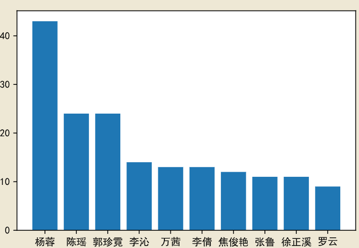

# 知乎
## 有哪些演员让你觉得不红实在太可惜了？让数据说话

从知乎回答中看到灵感，收集了这个问题的答案，从数据上看看哪些演员不红可惜了。 <br>

答案收集主要用到的的是Python的requests库

```Python
import requests
from json import loads
from urllib.parse import urlencode

class getZhihuAnswers(object):

    def __init__(self, questionID, page):
        headers = {
            'User-Agent':'Mozilla/5.0 (Windows NT 10.0; Win64; x64) AppleWebKit/537.36 (KHTML, like Gecko) Chrome/75.0.3770.100 Safari/537.36'
        }                #请求头
        conf = {   
            'include' : 'content',
            'limit' : 10,
            'offset' : page*10,
            'paltform' : 'desktop',
            'sort_by' : 'default'
        }                #url配置项
        self.url_main = 'https://www.zhihu.com/api/v4/questions/{}/answers?'.format(questionID)
        self.url = self.url_main + urlencode(conf)
        self.headers = headers
        
      
    def getPages(self):
        try:
            response = requests.get(self.url, headers = self.headers)
            print(self.url)
            page = loads(response.text)
            return page['data']
        except requests.exceptions.HTTPError:
            return None
```

数据主要存储在MongoDB中
```Python
import pymongo

class putMongo():

    def __init__(self, client='localhost', dbName='zhihu', colName='actors'):
        self.client = pymongo.MongoClient(client)
        self.db = self.client[dbName]
        self.col = self.db[colName] 
      
    def insertData(self, data, page):
        self.col.insert_many(data)
        print('已插入第{}页！'.format(page))
    
    def findData(self, items):

        choosedItems = {}
        for i in items:
            choosedItems[i] = 1

        data = self.col.find({}, choosedItems)
        return data
```
在拿到数据后，利用自然语言处理hanlp工具包中HMM算法识别演员人名，同时选取频率最大的人名作为答案。
```Python
def chooseName(contents):
    segment = ph.HanLP.newSegment().enableNameRecognize(True)
    i = 0
    actors = []
    while i >= 0:
        try:
            content = contents[i]
            items = segment.seg(content['content'])
            names = []
            for j in range(items.size()):
                if items.get(j).nature.toString() == 'nr':
                    names.append(items.get(j).word)

            if names != []:        
                counter_names = Counter(names)
                actors.append(counter_names.most_common(1)[0][0])

            if i % 50 == 0:
                print('{}ok！'.format(i))

        except IndexError as e:
            print('已完成')
            break
        i += 1
    return actors
```
最后选取前十名：


